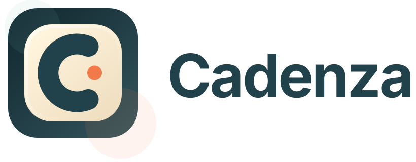
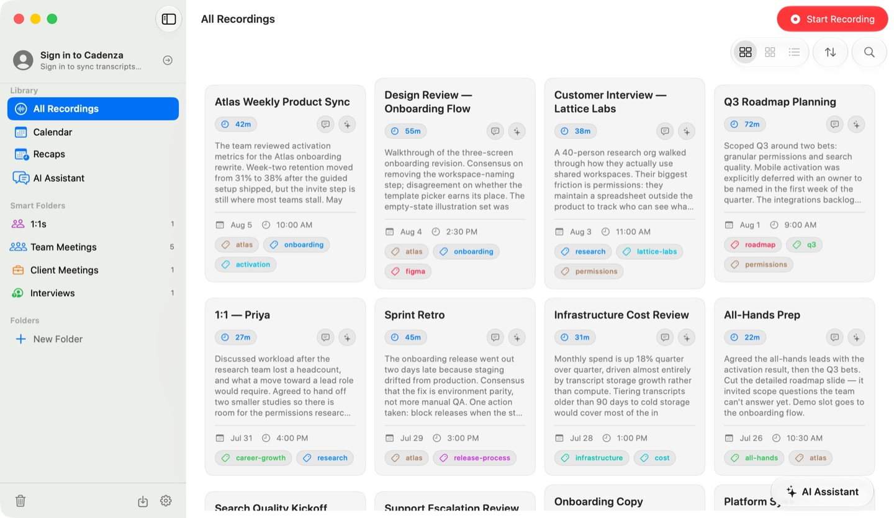
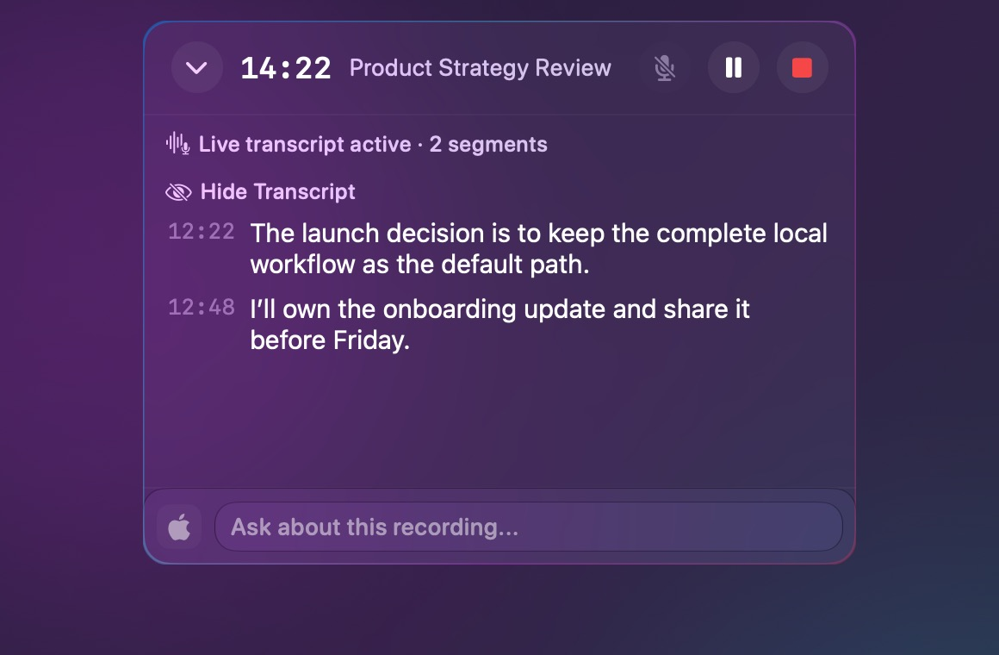
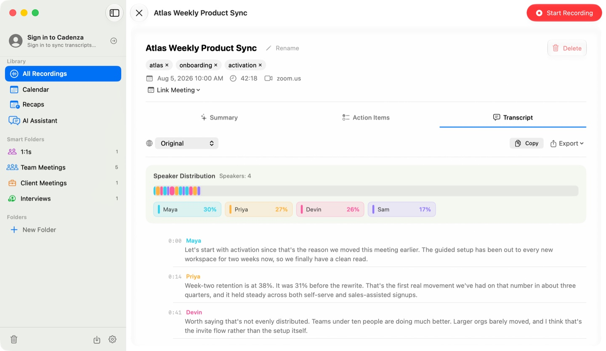
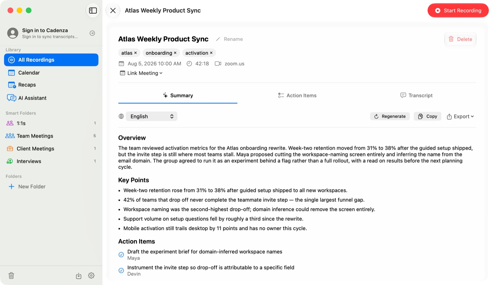
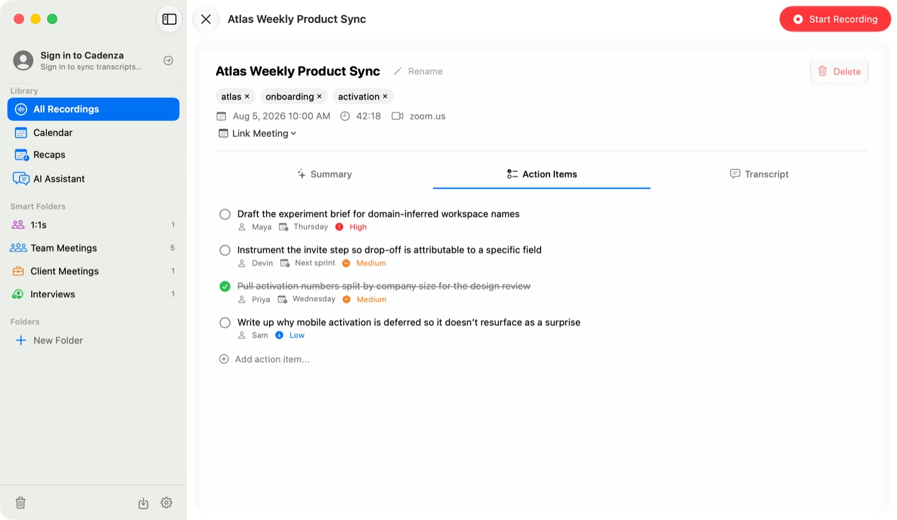
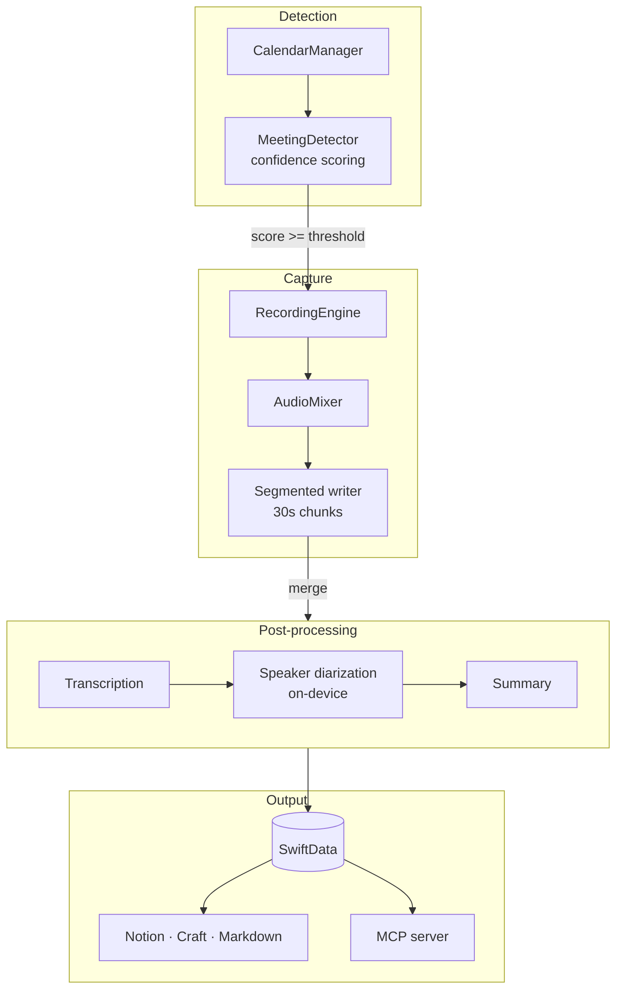

<div align="center">

<p><strong>English</strong> · <a href="README.zh-Hans.md">简体中文</a></p>

<h1>
  <picture>
    <source media="(prefers-color-scheme: dark)" srcset="docs/brand/cadenza-logo-cream.svg">
    
  </picture>
</h1>

**Turn meetings into useful knowledge without turning them into someone else’s data.**

Cadenza is a privacy-first meeting workspace built for the Mac. It captures system audio,
transcribes locally, remembers speakers, and turns conversations into searchable decisions
and action items. On supported Macs, the complete path from recording to transcript,
summary, chat, and export can run locally. No Cadenza account or hosted backend is required.

**Local-first when you want it. Provider choice when you need it. A self-hostable web path
for the future.**


<br>



</div>

---

## Why

Most meeting assistants begin with a hosted service. Cadenza begins with your Mac. It does
not require a Cadenza account or a hosted backend to record, organize, transcribe, search,
or export your meetings. When you enable meeting detection, it runs quietly in the
background, decides when a meeting is actually happening, and produces the artifact you
would have written by hand: an overview, decisions, and clear ownership of next steps.

### Privacy-first by design

- **A complete local workflow is available on supported Macs.** Record locally, transcribe
  with Whisper or Apple Speech, summarize and chat with Apple Foundation Models, search the
  local library, and export without sending meeting content to a Cadenza server.
- **No cloud is required for the desktop app.** On Macs without Apple Foundation Models,
  recording, local transcription, search, organization, and export still work locally;
  summaries can be skipped or sent to a provider you explicitly configure.
- **Your exit path is built in.** Markdown mirrors, batch exports, and verifiable portable
  archives keep your data useful outside the app. API keys and tokens are excluded from
  portable archives.
- **Self-hosting is the long-term web direction.** The planned web companion is intended to
  be deployable on infrastructure you control instead of forcing a vendor-hosted account.
  This is a roadmap direction, not a supported web release today.

## Features

### Optional automatic recording

- **Confidence-scored meeting detection.** Once you enable detection, Cadenza scores
  several signals — per-process microphone use, an active calendar event, meeting-window
  structure, system microphone state — and, if automatic recording is enabled, starts
  only when the combined score clears a threshold. Debounce, a grace period, and a minimum
  active hold keep it from flapping on transient signals.
- **System audio + microphone.** Captured through a Core Audio process tap, mixed into a
  single track. The microphone is optional and off by default.
- **Segmented writes.** After the recording has been durably registered, audio lands on disk
  every 30 seconds and unmerged segments can be recovered on the next launch.
- **Knows when to stop.** Auto-stop follows the same signals in reverse, with a silence
  watchdog for the case where a call ends but nothing else changes. Trailing silence is
  trimmed before the segments are merged.

### Stay in the meeting

The floating recording overlay keeps the essential controls in reach without pulling you
back into the library. See capture status and elapsed time, switch the microphone, pause or
stop, follow the live transcript, and ask what you missed while the conversation is still
happening.



<p align="center"><em>Capture controls, live context, and meeting-aware questions without leaving the conversation.</em></p>

### Transcription

| Engine | Runs | Notes |
| --- | --- | --- |
| Whisper (WhisperKit) | On-device | Free, models downloaded in-app |
| Apple Speech | On-device | No setup, no key |
| OpenAI | Cloud | Includes diarization-capable models |
| Gemini | Cloud | Batch and realtime |

Live transcription streams into the recording overlay while the meeting is still running.
Speaker diarization runs on-device via SpeakerKit, and named speakers are remembered
across meetings once you label them.



### Summaries and AI

- Structured output: overview, key points, decisions, follow-ups, and action items with
  assignee, deadline, and priority.
- Providers: OpenAI, Claude, Gemini, MiniMax, or Apple Foundation Models on-device.
- **Ask across meetings.** The chat assistant assembles context from your library —
  intent analysis picks the time range, speakers, and keywords, then fills a token budget
  with summaries, action items, and transcript excerpts.
- **Weekly and monthly recaps** aggregate everything that happened into one document.
- **Meeting prep** briefs can be generated before a meeting starts, from prior meetings
  with the same participants.

<table>
<tr>
<td width="50%"></td>
<td width="50%"></td>
</tr>
<tr>
<td align="center"><em>Structured summary</em></td>
<td align="center"><em>Action items, tracked and checkable</em></td>
</tr>
</table>

### Organization

Projects and folders, smart folders, and automatic tagging. Tags are normalized through a
shared canonicalization layer — case, separators, spelling variants, and English/Chinese
equivalents fold together, so `1-on-1`, `1on1`, and `1:1` stay one tag instead of three.

### Export and integrations

- **Notion** and **Craft** — one-click or automatic per recording.
- **Markdown mirror** — keep a plain-text copy of every meeting in a folder you choose.
- **Batch export** — one directory per recording with audio, transcript (txt/SRT/md),
  summary, and metadata.
- **Portable archive** — a verifiable portable export: SHA-256 per file, a versioned
  manifest, and a deterministic byte-identical output for the same input. It never contains
  keys or tokens. Cadenza does not currently import or restore this archive in-app.
- **Calendar** — EventKit and Google Calendar, plus Zoom meeting metadata.
- **MCP server** — expose your transcripts to Claude Code, Claude Desktop, Codex, Gemini
  CLI, or Hermes over a loopback HTTP server with bearer auth. Off by default; writes and
  meeting-context access are separate opt-in switches. Settings can write the client
  config for you.

## How it works



Cadenza is a single process — no XPC service, no helper daemon. `RecordingEngine` owns the
recording state machine and hands finished audio to `PostProcessingCoordinator`, which runs
transcription and summarization with bounded concurrency. All persistence goes through a
single SwiftData model actor.

For the full picture — thread model, numeric constants, known bottlenecks — see
[`ARCHITECTURE.md`](ARCHITECTURE.md).

## Getting started

**Requirements:** macOS 26 or later, Xcode 26+, and [XcodeGen](https://github.com/yonaskolb/XcodeGen).

### Why macOS 26 or later?

Cadenza currently chooses one modern, testable implementation over several partial fallback
paths. Its core stack uses macOS 26 APIs for targeted Core Audio process capture, Apple's
on-device `SpeechAnalyzer` transcription and Foundation Models, plus the current SwiftUI
window and visual system. Keeping the deployment target at macOS 26 lets the project test
the recording, recovery, local-AI, and accessibility behavior as one coherent product.

macOS 15 is not supported today. If there is enough user demand, the project can attempt to
lower the minimum to macOS 15. That work would require replacing the macOS 26 process-tap
construction, maintaining older UI paths, conditionally removing newer local-AI features,
and validating the complete recording lifecycle on macOS 15 hardware. It is a possible
future compatibility effort, not a current promise.

```bash
brew install xcodegen
```

Generate the project and build:

```bash
xcodegen generate
```

```bash
xcodebuild build -project Cadenza.xcodeproj -scheme Cadenza -destination 'platform=macOS' \
  CODE_SIGNING_ALLOWED=NO CODE_SIGNING_REQUIRED=NO
```

The no-sign command is the reproducible compile/test path for contributors and CI; it does
not produce a distributable app. To complete a first local recording:

1. Open `Cadenza.xcodeproj` in Xcode. Under **Signing & Capabilities**, select your own Apple
   Development team and preferably use a unique bundle identifier, then run the `Cadenza`
   scheme on **My Mac**. A stable development signature prevents macOS TCC from treating
   every rebuild as a new permission client.
2. Open **Settings → Recording** and select **Enable** beside **System Audio Recording**.
   Microphone capture is optional; grant microphone access only if you want your own voice.
3. Open **Settings → Transcription & Summary** and select the transcription and summary
   providers. Apple Speech needs no key. Whisper downloads a local model. A cloud provider
   requires its API key under **Settings → Integrations**.
4. Use the toolbar Record button, speak or play meeting audio, then Stop. Open the new library
   item and verify its audio, transcript, and summary. Calendar access is separately opt-in at
   **Settings → Integrations → Connections**.

## Configuration

Model IDs are never hardcoded in feature code. Each use resolves through `AIProvider`,
reading a UserDefaults override and falling back to a code default:

| Purpose | Override key |
| --- | --- |
| Summaries | `model.<provider>` |
| Chat | `model.<provider>` |
| Batch transcription | `transcriptionModel.<provider>` |
| Realtime transcription | `realtimeModel.<provider>` |

Edit them in Settings, or from the shell without restarting the app:

```bash
defaults write com.shuiandy.Cadenza realtimeModel.gemini <model-id>
```

## Privacy

- **Local by default.** Recordings, transcripts, and summaries live in a local SwiftData
  database. Nothing is uploaded unless you connect a cloud provider or opt into sync.
- **An offline path is available on supported hardware.** Whisper or Apple Speech keeps
  transcription local. Apple Foundation Models can also keep summaries local on eligible
  Macs after required model downloads; otherwise summary generation needs a cloud provider.
- **Sync is opt-in and staged.** Historical recordings are never uploaded before you
  consent to it explicitly; audio upload is a separate switch that stays off unless you
  turn it on.
- **The MCP server is off by default**, binds to loopback only, and requires a bearer
  token. Read access, write access, and meeting-context access are three separate toggles.
- **Archives never contain secrets.** API keys, tokens, and session state are excluded by
  construction.
- **Recording notice remains your responsibility.** Make sure participants know a meeting
  is being recorded, and follow applicable laws and workplace policies.

See [`docs/data-and-privacy.md`](docs/data-and-privacy.md) for the technical data-flow and
permission inventory. It documents what stays local and what each opt-in integration can
send; it is not a substitute for a distributor's privacy policy.

## Backup, restore, and uninstall

- Thirty-second audio segments are crash-recovery evidence for an interrupted recording;
  they are not a substitute for a library backup.
- Cadenza creates up to three consistent SQLite recovery backups for the active profile.
  They can be cleared from **Settings → General → Export & Backup**, but the current UI does
  not provide a database restore command.
- Portable archives and batch exports are verifiable exports. Keep them for external
  processing or future migration, but do not rely on them as an in-app restore path today.
- Before uninstalling, export anything you need, permanently empty Trash, disconnect cloud
  integrations, and clear automatic backups. Quit Cadenza, remove the app, then remove its
  `~/Library/Application Support/Cadenza` data if you want the local library gone. A custom
  recording folder is outside that directory and must be reviewed separately. Remove saved
  `com.shuiandy.Cadenza` credentials in Keychain Access if you also want local secrets gone.

Removing local files does not delete data already held by an AI provider, export destination,
or Web Sync deployment. Use that service's deletion controls and policy.

## Support, roadmap, and known limitations

- Use the GitHub issue templates for reproducible bugs and feature requests. Report security
  issues privately through [`SECURITY.md`](SECURITY.md), never in a public issue.
- The public roadmap is the issue tracker; an open request is not a delivery commitment.
- Cadenza currently targets macOS 26+. The rationale and possible macOS 15 compatibility
  direction are described in [Getting started](#why-macos-26-or-later). Apple Foundation
  Models require an eligible Mac.
- Portable archives have no in-app importer, and automatic database backups have no in-app
  restore command. Web Sync behavior, quotas, retention, and cost depend on its operator.
- A process exit during the short startup interval after hardware capture begins but before
  the recording row is committed can leave a segments directory that is not yet discovered
  by automatic recovery. A two-phase durable-start design is still planned for this edge case.
- This repository's CI builds and tests unsigned source. A normal-user binary still requires
  Developer ID signing, notarization, Gatekeeper and upgrade testing, plus device and
  accessibility beta validation.

## Development

Run the test suite:

```bash
xcodebuild test -project Cadenza.xcodeproj -scheme Cadenza -destination 'platform=macOS' \
  CODE_SIGNING_ALLOWED=NO CODE_SIGNING_REQUIRED=NO
```

Tail the detection and recording lifecycle while the app runs:

```bash
log stream --predicate 'process == "Cadenza"' --style compact
```

Logs use bracketed component prefixes such as `[MeetingDetector]` and `[RecordingEngine]`.
For after-the-fact debugging, use `log show --last 2h --predicate 'process == "Cadenza"'`.

### Running an isolated visual-QA instance

DEBUG builds accept `CADENZA_DATA_ROOT` for Cadenza-owned filesystem data: the profile
registry, stores, backups, chat history, and app-managed audio. It does **not** relocate
macOS privacy grants, system calendars, network traffic, or code-signing/notarization state.
The isolated runtime instead uses a process-memory Keychain and ephemeral app authority;
`CFFIXED_USER_HOME` must be a separate, existing child directory *inside
`CADENZA_DATA_ROOT`* for Foundation preferences and caches.

Use a new system-temporary root for every run. The screenshot seeder is inert unless the
test runner receives `TEST_RUNNER_CADENZA_DEMO_SEED_STORE`; it rejects relative paths,
existing stores or SQLite sidecars, symlink escapes, the source repository, and every real
Cadenza library location before constructing a SwiftData container. Its nearest existing
ancestor must already be a current-uid-owned, non-shared directory below a canonical system
temporary root. Inject the opt-in into the generated `.xctestrun`; arbitrary shell variables
on `xcodebuild test` are not forwarded to the hosted test process. Do not give the seed build
or test `CADENZA_DATA_ROOT` or `CFFIXED_USER_HOME`:

```bash
DEMO_ROOT="$(mktemp -d /private/tmp/cadenza-demo.XXXXXX)"
DEMO_DATA_ROOT="$DEMO_ROOT/data"
DEMO_FIXED_HOME="$DEMO_DATA_ROOT/fixed-home"
DEMO_STORE="$DEMO_DATA_ROOT/Application Support/Cadenza/Cadenza.store"
DEMO_DERIVED_DATA="$DEMO_ROOT/DerivedData"
mkdir -p "$DEMO_FIXED_HOME"
chmod 700 "$DEMO_ROOT" "$DEMO_DATA_ROOT" "$DEMO_FIXED_HOME"

env -u CADENZA_DATA_ROOT -u CFFIXED_USER_HOME \
  -u TEST_RUNNER_CADENZA_DEMO_SEED_STORE \
  xcodebuild build-for-testing -project Cadenza.xcodeproj -scheme Cadenza \
  -destination 'platform=macOS' \
  -derivedDataPath "$DEMO_DERIVED_DATA" \
  CODE_SIGNING_ALLOWED=NO CODE_SIGNING_REQUIRED=NO

DEMO_XCTESTRUN="$(find "$DEMO_DERIVED_DATA/Build/Products" -maxdepth 1 \
  -name 'Cadenza_*.xctestrun' -print -quit)"
test -n "$DEMO_XCTESTRUN"
plutil -insert \
  'CadenzaTests.EnvironmentVariables.TEST_RUNNER_CADENZA_DEMO_SEED_STORE' \
  -string "$DEMO_STORE" "$DEMO_XCTESTRUN"

env -u CADENZA_DATA_ROOT -u CFFIXED_USER_HOME \
  -u TEST_RUNNER_CADENZA_DEMO_SEED_STORE \
  xcodebuild test-without-building -xctestrun "$DEMO_XCTESTRUN" \
  -destination 'platform=macOS' \
  -resultBundlePath "$DEMO_ROOT/DemoSeed.xcresult" \
  -only-testing:CadenzaTests/DemoSeedTests

test "$(sqlite3 -readonly "$DEMO_STORE" \
  'SELECT COUNT(*) FROM ZRECORDING;')" = "12"
```

For a visual walkthrough, first block network access for the DEBUG binary as an independent
defense and leave all macOS permissions ungranted. A valid two-variable DEBUG launch enters
`isolatedFixture` automatically; there are no additional launch arguments. It opens the
direct fixture store with ephemeral defaults/auth and a process-memory Keychain, then loads
only fixture chat, recordings, folders, and Trash. It does not run live profile bootstrap,
OAuth/browser flows, TCC checks, EventKit/Google/Zoom access, Web Sync, Notion/Craft network
exports, MCP, meeting detection, global hotkeys, hardware capture, Markdown mirroring,
maintenance, or automatic generation. Local file and portable-archive exports remain local:

```bash
APP=/absolute/path/to/Cadenza.app
env \
  CADENZA_DATA_ROOT="$DEMO_DATA_ROOT" \
  CFFIXED_USER_HOME="$DEMO_FIXED_HOME" \
  "$APP/Contents/MacOS/Cadenza" &
DEMO_PID=$!

ps -p "$DEMO_PID" -o pid=,command=
lsof -p "$DEMO_PID" | rg -F "$DEMO_DATA_ROOT"
log show --last 2m --predicate "processIdentifier == $DEMO_PID" --style compact | \
  rg '\[DebugDataRoot\] isolated runtime|\[AppState\] setup: isolated fixture runtime'
```

Inspect that PID's complete `lsof` output and prove it has no handles under the physical
user's real `~/Library/Application Support/Cadenza` or `~/Documents/Cadenza` trees. Invalid,
missing, symlink-escaped, shared-writable, home, or repository roots show an inert halt shell
instead of falling back to the standard runtime. If fixture content or either expected log
line is absent, or a real account, calendar, integration, or library appears, do not
interact. Terminate only that PID with `kill -TERM "$DEMO_PID"` followed by
`wait "$DEMO_PID"`; never use `killall Cadenza` while another instance may be open.

`DebugDataRootTests` checks the app-owned filesystem seam. The shared Whisper model cache
is the deliberate filesystem exception because it is large, read-only, and contains no
user content. An unlocked Mac is required to inspect rendered UI, but this fixture workflow
does not exercise real TCC permission flows and does not validate signing, Gatekeeper, or
notarization.

### Project layout

```
Cadenza/
├── App/          AppState, boot sequence, window chrome
├── Models/       SwiftData models, AI provider config
├── Services/
│   ├── Meeting/  Detection, confidence scoring, window analysis
│   ├── Audio/    Capture, segmented writing, merging
│   ├── Transcription/  Whisper, Apple, OpenAI, Gemini
│   ├── AI/       Summaries, chat context, recaps, meeting prep
│   ├── Persistence/    RecordingsStore (SwiftData model actor)
│   ├── Profiles/ Profile registry, storage migration, sessions
│   ├── Export/   Notion, Craft, Markdown, portable archive
│   └── MCP/      Loopback MCP server
└── Views/        SwiftUI views
```

### Documentation

| Document | What's in it |
| --- | --- |
| [`ARCHITECTURE.md`](ARCHITECTURE.md) | Full architecture: pipelines, thread model, constants, known issues |
| [`CONTRIBUTING.md`](CONTRIBUTING.md) | Build, test, localization, and pull-request expectations |
| [`CODE_OF_CONDUCT.md`](CODE_OF_CONDUCT.md) | Community participation and private-data expectations |
| [`SECURITY.md`](SECURITY.md) | Private vulnerability reporting and supported-version policy |
| [`docs/data-and-privacy.md`](docs/data-and-privacy.md) | Technical data flow, permissions, storage, and opt-in network boundaries |
| [`docs/beta-test-plan.md`](docs/beta-test-plan.md) | User-acceptance protocol and measurable release gates |
| [`docs/entitlements-contract.md`](docs/entitlements-contract.md) | Web Sync subscription, quota, grace, and retention contract |

Before changing anything that touches the recording lifecycle, post-processing,
persistence, or user-visible state, read the relevant section of `ARCHITECTURE.md` and
update it in the same change.

### License

Cadenza is licensed under the [Apache License 2.0](LICENSE). Third-party
licenses and required notices are listed in
[`THIRD_PARTY_NOTICES.md`](THIRD_PARTY_NOTICES.md).
