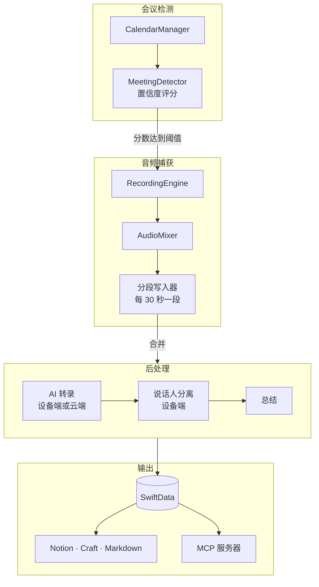

<div align="center">

<p><a href="README.md">English</a> · <strong>简体中文</strong></p>

<h1>
  <picture>
    <source media="(prefers-color-scheme: dark)" srcset="docs/brand/cadenza-logo-cream.svg">
    
  </picture>
</h1>

**Mac 上的 AI 会议转录工具——转录稿始终属于你自己。**

Cadenza 会录下你的会议，用 AI 转成文字，分辨出每个说话人，并把结果整理成可搜索的
转录稿，以及结构化的总结、决策和行动项。转录引擎可以按需切换：**Whisper** 和
**Apple Speech** 完全在设备端运行，需要云端模型时还可以选择 **OpenAI** 和 **Gemini**。
在受支持的 Mac 上，从录音、转录、总结、聊天到导出的完整流程都可以在本地完成，
不需要 Cadenza 账号，也不依赖托管后端。

**录音 → AI 转录 → 说话人标注 → 总结 · 决策 · 行动项 → 搜索与导出**


<br>


<p align="center"><em>带说话人归属和时间戳的转录稿——默认在设备端生成。</em></p>

</div>

---

## 为什么开发 Cadenza

会议转录通常意味着把整个会议室的音频上传到别人的服务器。Cadenza 把同一条流水线放在
你的 Mac 上运行：把语音转成文字的 AI、区分说话人的模型，以及撰写总结的模型，都可以在
设备端执行，不需要 Cadenza 账号，也不依赖 Cadenza 托管的后端。当你启用会议检测后，
它会安静地在后台运行，判断会议是否真的正在进行，并生成原本需要你手动整理的内容，
包括完整转录稿、会议概览、已经做出的决策，以及每个人接下来要完成的事项。

### 隐私优先并非口号，而是架构选择

- **受支持的 Mac 可以完成全流程本地处理。** 在本地录音，使用 Whisper 或 Apple Speech
  转录，通过 Apple Foundation Models 完成总结与聊天，在本地资料库中搜索，并直接导出，
  全程无需把会议内容发送到 Cadenza 服务器。
- **桌面应用不要求云端。** 不支持 Apple Foundation Models 的 Mac 仍能在本地完成录音、
  转录、搜索、整理和导出；你可以跳过总结，也可以明确选择自己信任的云端服务商。
- **数据随时可以带走。** Markdown 镜像、批量导出和可验证的便携归档，让数据脱离应用后
  仍然可用；便携归档不会包含 API 密钥或 token。
- **Web 端的长期方向是支持自托管。** 未来计划中的 Web companion 将以可部署到自有基础设施
  为目标，而不是强制依赖厂商托管账号。这是路线图方向，并非当前已经发布的 Web 功能。

## 功能

### AI 转录

四个可自由切换的转录引擎，其中两个完全不联网。默认引擎是 Apple Speech，
因此在你主动更换之前，转录始终在设备端完成：

| 引擎 | 运行位置 | 说明 |
| --- | --- | --- |
| Whisper（WhisperKit） | 设备端 | 免费，模型可在应用内下载 |
| Apple Speech | 设备端 | 无需配置或 API 密钥 |
| OpenAI | 云端 | 包含支持说话人分离的模型 |
| Gemini | 云端 | 支持批量和实时转录 |

- **实时转录。** 会议仍在进行时，文字会持续显示在录音浮层中，不必等录音结束就能回看
  刚刚过去的一分钟。
- **设备端说话人分离。** SpeakerKit 在本地区分不同声音；一旦你为某个说话人命名，
  Cadenza 会在后续会议中认出他们，并自动归属对应的发言。
- **可以直接使用的转录稿。** 按说话人归类的时间戳片段、说话时长分布、跨资料库全文搜索，
  以及导出为 txt、SRT 或 Markdown。

### 总结与 AI

- 结构化输出：概览、要点、决策、后续事项，以及带负责人、截止日期和优先级的行动项。
- 服务商：OpenAI、Claude、Gemini、MiniMax，或设备端 Apple Foundation Models。
- **跨会议提问。** 聊天助手会从资料库中组装上下文。它先分析意图并确定时间范围、说话人
  和关键词，再在 token 预算内填入总结、行动项和转录摘录。
- **每周和每月回顾**会把期间发生的内容聚合成一份文档。
- **会前准备**可以在会议开始前，根据与相同参会者的历史会议生成简报。

<table>
<tr>
<td width="50%"></td>
<td width="50%"></td>
</tr>
<tr>
<td align="center"><em>结构化总结</em></td>
<td align="center"><em>可跟踪、可勾选的行动项</em></td>
</tr>
</table>

### 留在会议中，不必切回资料库

悬浮录音浮层把关键操作始终放在手边。你可以直接查看录音状态与时长、切换麦克风、暂停或
停止录音、跟随实时转录，还能在讨论仍在继续时立刻询问自己刚刚错过了什么。


<p align="center"><em>无需离开当前对话，即可使用录音控制、实时上下文和会中提问。</em></p>

### 可选的自动录制

转录的前提是录音真的开始了。Cadenza 可以替你做这个判断：

- **基于置信度的会议检测。** 启用检测后，Cadenza 会综合多个信号进行评分，包括进程级
  麦克风占用、当前日历事件、会议窗口特征和系统麦克风状态。只有在同时启用自动录制，
  且综合分数达到阈值时才会开始录制。防抖、宽限期和最短活跃时间可避免因瞬时信号反复启停。
- **系统音频和麦克风。** 通过 Core Audio process tap 捕获并混合成单一音轨。
  麦克风为可选项，默认关闭。
- **分段写入。** 录音在数据库中完成持久化登记后，音频每 30 秒写入磁盘一次；
  尚未合并的分段可以在下次启动时恢复。
- **知道何时停止。** 自动停止会反向检查同一组信号；如果通话已经结束但其他信号没有变化，
  静音看门狗也会介入。分段合并前会先裁掉末尾静音。

### 整理与分类

Cadenza 支持项目、文件夹、智能文件夹和自动标签。标签通过统一的规范化层处理大小写、
分隔符、拼写变体以及中英文等价词，因此 `1-on-1`、`1on1` 和 `1:1` 会保持为同一个标签，
而不是三个重复标签。


### 导出与集成

- **Notion** 和 **Craft**：支持单次导出或按录音自动导出。
- **Markdown 镜像**：在你选择的文件夹中保留每场会议的纯文本副本。
- **批量导出**：每条录音生成一个目录，包含音频、转录（txt/SRT/md）、总结和元数据。
- **便携归档**：可验证的便携导出格式。每个文件都有 SHA-256，包含带版本的 manifest，
  相同输入会生成字节完全一致的确定性输出。归档绝不包含密钥或 token。
  Cadenza 目前还不能在应用内导入或恢复这种归档。
- **日历**：支持 EventKit 和 Google Calendar，以及 Zoom 会议元数据。
- **MCP 服务器**：通过带 Bearer 身份验证的回环 HTTP 服务器，将转录开放给 Claude Code、
  Claude Desktop、Codex、Gemini CLI 或 Hermes。默认关闭；写入权限和会议上下文访问分别独立
  选择启用。设置页面可以代你写入客户端配置。

## 工作原理



Cadenza 采用单进程架构，没有 XPC 服务，也没有辅助守护进程。`RecordingEngine` 负责录音状态机，
并把完成的音频交给 `PostProcessingCoordinator`；后者以受限并发方式执行转录和总结。
所有持久化操作都通过单一 SwiftData model actor 完成。

线程模型、数值常量和已知瓶颈等完整信息请参阅
[`ARCHITECTURE.md`](ARCHITECTURE.md)。

## 快速开始

**要求：** macOS 26 或更高版本、Xcode 26+，以及
[XcodeGen](https://github.com/yonaskolb/XcodeGen)。

### 为什么需要 macOS 26 或更高版本？

Cadenza 当前选择维护一套现代、可完整测试的实现，而不是同时维护多条能力不一致的兼容路径。
核心技术栈使用了 macOS 26 的定向 Core Audio 进程捕获、Apple 设备端 `SpeechAnalyzer`
转录与 Foundation Models，以及当前一代 SwiftUI 窗口和视觉 API。将最低版本保持在 macOS 26，
可以让录音、崩溃恢复、本地 AI 和辅助功能作为一个完整产品一起接受验证。

目前不支持 macOS 15。如果未来用户需求足够明确，项目可以尝试把最低系统版本降到 macOS 15。
这需要替换 macOS 26 专用的 process tap 构造方式、维护旧版 UI 路径、按系统能力移除较新的
本地 AI 功能，并在真实 macOS 15 设备上重新验证完整录音生命周期。这是一项可能的未来兼容
工作，不是当前承诺。

```bash
brew install xcodegen
```

生成工程并构建：

```bash
xcodegen generate
```

```bash
xcodebuild build -project Cadenza.xcodeproj -scheme Cadenza -destination 'platform=macOS' \
  CODE_SIGNING_ALLOWED=NO CODE_SIGNING_REQUIRED=NO
```

上述无签名命令是贡献者和 CI 使用的可复现编译/测试路径，不会生成可分发应用。
要完成第一次本地录制：

1. 在 Xcode 中打开 `Cadenza.xcodeproj`。进入 **Signing & Capabilities**，选择你自己的 Apple
   Development Team，最好同时使用唯一的 bundle identifier，然后在 **My Mac** 上运行
   `Cadenza` scheme。稳定的开发签名可以避免 macOS TCC 把每次重新构建都视为新的权限客户端。
2. 打开 **设置 → 录音**，在 **系统音频录制** 旁选择 **启用**。麦克风捕获为可选项；
   只有在需要录下自己的声音时才授予麦克风权限。
3. 打开 **设置 → 转录与总结**，选择转录和总结服务商。Apple Speech 不需要密钥；
   Whisper 会下载本地模型；云端服务商需要在 **设置 → 集成** 中配置 API 密钥。
4. 使用工具栏的录制按钮，讲话或播放会议音频，然后点击停止。打开资料库中新生成的条目，
   检查音频、转录和总结。日历访问需要在 **设置 → 集成 → 连接** 中单独启用。

## 配置

模型 ID 不会硬编码在功能代码中。每个使用点都通过 `AIProvider` 解析，读取 UserDefaults
覆盖值，并在没有覆盖时使用代码默认值：

| 用途 | 覆盖键 |
| --- | --- |
| 总结 | `model.<provider>` |
| 聊天 | `model.<provider>` |
| 批量转录 | `transcriptionModel.<provider>` |
| 实时转录 | `realtimeModel.<provider>` |

你可以在设置中修改，也可以从 shell 写入而无需重启应用：

```bash
defaults write com.shuiandy.Cadenza realtimeModel.gemini <model-id>
```

## 隐私

- **默认保存在本地。** 录音、转录和总结存放在本地 SwiftData 数据库中。除非你连接云端
  服务商或主动启用同步，否则不会上传任何内容。
- **受支持的硬件提供离线路径。** Whisper 或 Apple Speech 可以让转录留在本地。
  在符合条件的 Mac 上，下载所需模型后，Apple Foundation Models 也能在本地生成总结；
  否则总结需要云端服务商。
- **同步为选择启用且分阶段进行。** 在你明确同意前，历史录音绝不会上传；音频上传是独立开关，
  除非你主动开启，否则始终保持关闭。
- **MCP 服务器默认关闭，**仅绑定回环地址，并要求 Bearer token。读取、写入和会议上下文访问
  是三个独立开关。
- **归档绝不包含秘密信息。** API 密钥、token 和会话状态在结构设计上就被排除。
- **录音告知仍是你的责任。** 请确保参会者知道会议正在被录制，并遵守适用的法律和工作场所政策。

技术数据流和权限清单请参阅
[`docs/data-and-privacy.md`](docs/data-and-privacy.md)。该文档说明哪些数据留在本地，以及每个
选择启用的集成可以发送哪些内容；它不能替代分发者自己的隐私政策。

## 备份、恢复与卸载

- 30 秒音频分段是录音中断后的崩溃恢复证据，不能替代资料库备份。
- Cadenza 会为当前配置档案创建最多三份一致的 SQLite 恢复备份。你可以在
  **设置 → 通用 → 导出与备份** 中清除它们，但当前 UI 不提供数据库恢复命令。
- 便携归档和批量导出都是可验证的导出格式。你可以保留它们用于外部处理或未来迁移，
  但目前不能把它们当作应用内恢复路径。
- 卸载前，请导出需要保留的内容、永久清空废纸篓、断开云端集成并清除自动备份。
  退出 Cadenza 并移除应用；如果还要删除本地资料库，再删除
  `~/Library/Application Support/Cadenza` 下的数据。自定义录音文件夹位于该目录之外，
  需要单独检查。如果还要删除本地秘密信息，请在“钥匙串访问”中移除保存的
  `com.shuiandy.Cadenza` 凭据。

删除本地文件不会删除 AI 服务商、导出目标或 Web Sync 部署中已经保存的数据。
请使用相应服务提供的删除功能并遵循其政策。

## 支持、路线图与已知限制

- 请使用 GitHub issue 模板提交可复现的错误和功能建议。安全问题应通过
  [`SECURITY.md`](SECURITY.md) 中的私密渠道报告，切勿发布在公开 issue 中。
- 公开路线图就是 issue tracker；一条开放的请求不代表交付承诺。
- Cadenza 当前要求 macOS 26+；原因与未来尝试支持 macOS 15 的方向见
  [快速开始](#为什么需要-macos-26-或更高版本)。Apple Foundation Models 需要符合条件的 Mac。
- 便携归档没有应用内导入器，自动数据库备份也没有应用内恢复命令。
  Web Sync 的行为、配额、保留期限和成本取决于其运营方。
- 如果进程恰好在硬件捕获开始后、录音数据库行提交前的短暂启动窗口内退出，可能留下一个
  尚未被自动恢复发现的分段目录。针对这一边界的两阶段持久化启动设计仍在规划中。
- 本仓库的 CI 会构建和测试无签名源码。面向普通用户的二进制文件仍需要完成 Developer ID
  签名、公证、Gatekeeper 和升级测试，以及真实设备与辅助功能 beta 验证。

## 开发

运行测试套件：

```bash
xcodebuild test -project Cadenza.xcodeproj -scheme Cadenza -destination 'platform=macOS' \
  CODE_SIGNING_ALLOWED=NO CODE_SIGNING_REQUIRED=NO
```

应用运行时，持续查看会议检测和录音生命周期日志：

```bash
log stream --predicate 'process == "Cadenza"' --style compact
```

日志使用 `[MeetingDetector]`、`[RecordingEngine]` 等带方括号的组件前缀。
如需查看历史日志，请使用
`log show --last 2h --predicate 'process == "Cadenza"'`。

### 运行隔离的视觉 QA 实例

DEBUG 构建接受 `CADENZA_DATA_ROOT`，用于重定向 Cadenza 自有的文件系统数据，包括配置档案
注册表、数据库、备份、聊天历史和应用管理的音频。它**不会**重定向 macOS 隐私授权、系统日历、
网络流量或代码签名/公证状态。隔离运行时会改用进程内存钥匙串和临时应用权限；
`CFFIXED_USER_HOME` 必须指向 `CADENZA_DATA_ROOT` **内部**一个已存在的独立子目录，
以隔离 Foundation 偏好设置和缓存。

每次运行都应创建新的系统临时根目录。只有测试运行器收到
`TEST_RUNNER_CADENZA_DEMO_SEED_STORE` 时，截图数据播种器才会启用。它会在构建 SwiftData
容器前拒绝相对路径、已有数据库或 SQLite sidecar、符号链接逃逸、源码仓库以及所有真实
Cadenza 资料库位置。最近的已存在祖先目录必须位于规范化系统临时根目录下，由当前 uid 所有，
且不能是共享可写目录。需要把该选择启用变量写入生成的 `.xctestrun`；直接传给
`xcodebuild test` 的任意 shell 变量不会被转发给托管测试进程。不要向播种构建或测试传入
`CADENZA_DATA_ROOT` 或 `CFFIXED_USER_HOME`：

```bash
DEMO_ROOT="$(mktemp -d /private/tmp/cadenza-demo.XXXXXX)"
DEMO_DATA_ROOT="$DEMO_ROOT/data"
DEMO_FIXED_HOME="$DEMO_DATA_ROOT/fixed-home"
DEMO_STORE="$DEMO_DATA_ROOT/Application Support/Cadenza/Cadenza.store"
DEMO_DERIVED_DATA="$DEMO_ROOT/DerivedData"
mkdir -p "$DEMO_FIXED_HOME"
chmod 700 "$DEMO_ROOT" "$DEMO_DATA_ROOT" "$DEMO_FIXED_HOME"

env -u CADENZA_DATA_ROOT -u CFFIXED_USER_HOME \
  -u TEST_RUNNER_CADENZA_DEMO_SEED_STORE \
  xcodebuild build-for-testing -project Cadenza.xcodeproj -scheme Cadenza \
  -destination 'platform=macOS' \
  -derivedDataPath "$DEMO_DERIVED_DATA" \
  CODE_SIGNING_ALLOWED=NO CODE_SIGNING_REQUIRED=NO

DEMO_XCTESTRUN="$(find "$DEMO_DERIVED_DATA/Build/Products" -maxdepth 1 \
  -name 'Cadenza_*.xctestrun' -print -quit)"
test -n "$DEMO_XCTESTRUN"
plutil -insert \
  'CadenzaTests.EnvironmentVariables.TEST_RUNNER_CADENZA_DEMO_SEED_STORE' \
  -string "$DEMO_STORE" "$DEMO_XCTESTRUN"

env -u CADENZA_DATA_ROOT -u CFFIXED_USER_HOME \
  -u TEST_RUNNER_CADENZA_DEMO_SEED_STORE \
  xcodebuild test-without-building -xctestrun "$DEMO_XCTESTRUN" \
  -destination 'platform=macOS' \
  -resultBundlePath "$DEMO_ROOT/DemoSeed.xcresult" \
  -only-testing:CadenzaTests/DemoSeedTests

test "$(sqlite3 -readonly "$DEMO_STORE" \
  'SELECT COUNT(*) FROM ZRECORDING;')" = "12"
```

进行视觉走查前，先将 DEBUG 二进制的网络访问作为独立防线阻断，并保持所有 macOS 权限
未授予状态。有效的双变量 DEBUG 启动会自动进入 `isolatedFixture`，无需额外启动参数。
它会使用临时 defaults/权限和进程内存钥匙串直接打开测试数据数据库，只加载测试聊天、录音、
文件夹和废纸篓。它不会运行真实配置档案初始化、OAuth/浏览器流程、TCC 检查、
EventKit/Google/Zoom 访问、Web Sync、Notion/Craft 网络导出、MCP、会议检测、全局快捷键、
硬件捕获、Markdown 镜像、维护任务或自动生成。本地文件导出和便携归档仍只在本地进行：

```bash
APP=/absolute/path/to/Cadenza.app
env \
  CADENZA_DATA_ROOT="$DEMO_DATA_ROOT" \
  CFFIXED_USER_HOME="$DEMO_FIXED_HOME" \
  "$APP/Contents/MacOS/Cadenza" &
DEMO_PID=$!

ps -p "$DEMO_PID" -o pid=,command=
lsof -p "$DEMO_PID" | rg -F "$DEMO_DATA_ROOT"
log show --last 2m --predicate "processIdentifier == $DEMO_PID" --style compact | \
  rg '\[DebugDataRoot\] isolated runtime|\[AppState\] setup: isolated fixture runtime'
```

检查该 PID 的完整 `lsof` 输出，确认它没有打开真实用户目录下
`~/Library/Application Support/Cadenza` 或 `~/Documents/Cadenza` 中的任何文件。
如果根目录无效、缺失、通过符号链接逃逸、共享可写，或指向 home/源码仓库，应用会显示
不可操作的停止页面，而不会回退到标准运行时。如果测试数据、任一期望日志行缺失，或界面中出现
真实账户、日历、集成或资料库，请勿继续操作。只使用 `kill -TERM "$DEMO_PID"` 终止该 PID，
随后执行 `wait "$DEMO_PID"`；当另一实例可能正在运行时，绝不要使用 `killall Cadenza`。

`DebugDataRootTests` 会检查应用自有文件系统的隔离 seam。共享 Whisper 模型缓存是有意保留的
文件系统例外，因为它体积较大、只读且不包含用户内容。检查渲染界面需要已解锁的 Mac；
该测试数据流程不会覆盖真实 TCC 权限，也不能验证签名、Gatekeeper 或公证。

### 项目结构

```text
Cadenza/
├── App/          AppState、启动流程、窗口外观
├── Models/       SwiftData 模型、AI 服务商配置
├── Services/
│   ├── Meeting/  会议检测、置信度评分、窗口分析
│   ├── Audio/    音频捕获、分段写入、合并
│   ├── Transcription/  Whisper、Apple、OpenAI、Gemini
│   ├── AI/       总结、聊天上下文、回顾、会前准备
│   ├── Persistence/    RecordingsStore（SwiftData model actor）
│   ├── Profiles/ 配置档案注册、存储迁移、会话
│   ├── Export/   Notion、Craft、Markdown、便携归档
│   └── MCP/      回环 MCP 服务器
└── Views/        SwiftUI 视图
```

### 文档

| 文档 | 内容 |
| --- | --- |
| [`ARCHITECTURE.md`](ARCHITECTURE.md) | 完整架构：处理管线、线程模型、常量和已知问题 |
| [`CONTRIBUTING.md`](CONTRIBUTING.md) | 构建、测试、本地化和 Pull Request 要求 |
| [`CODE_OF_CONDUCT.md`](CODE_OF_CONDUCT.md) | 社区参与和私密数据规范 |
| [`SECURITY.md`](SECURITY.md) | 私密漏洞报告和受支持版本政策 |
| [`docs/data-and-privacy.md`](docs/data-and-privacy.md) | 技术数据流、权限、存储和选择启用的网络边界 |
| [`docs/beta-test-plan.md`](docs/beta-test-plan.md) | 用户验收流程和可量化发布门禁 |
| [`docs/entitlements-contract.md`](docs/entitlements-contract.md) | Web Sync 订阅、配额、宽限和保留约定 |

在修改任何涉及录音生命周期、后处理、持久化或用户可见状态的代码前，请先阅读
`ARCHITECTURE.md` 的相关章节，并在同一次变更中同步更新文档。

### 许可证

Cadenza 采用 [Apache License 2.0](LICENSE) 许可。
第三方许可证和必要声明请参阅
[`THIRD_PARTY_NOTICES.md`](THIRD_PARTY_NOTICES.md)。
